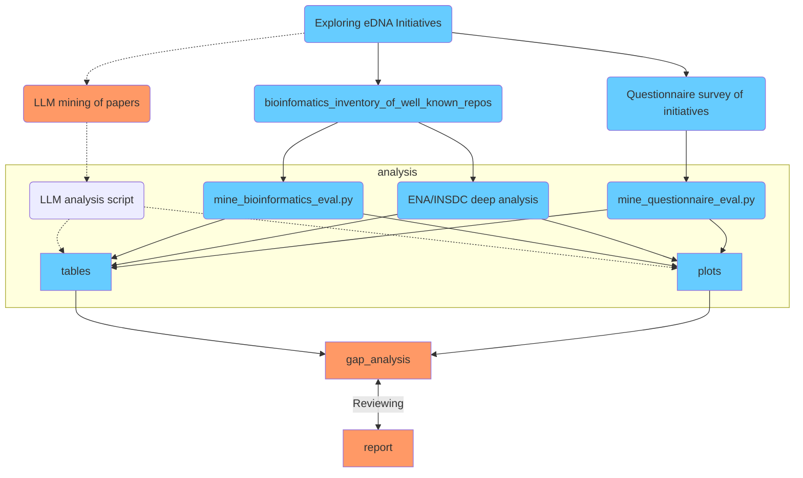
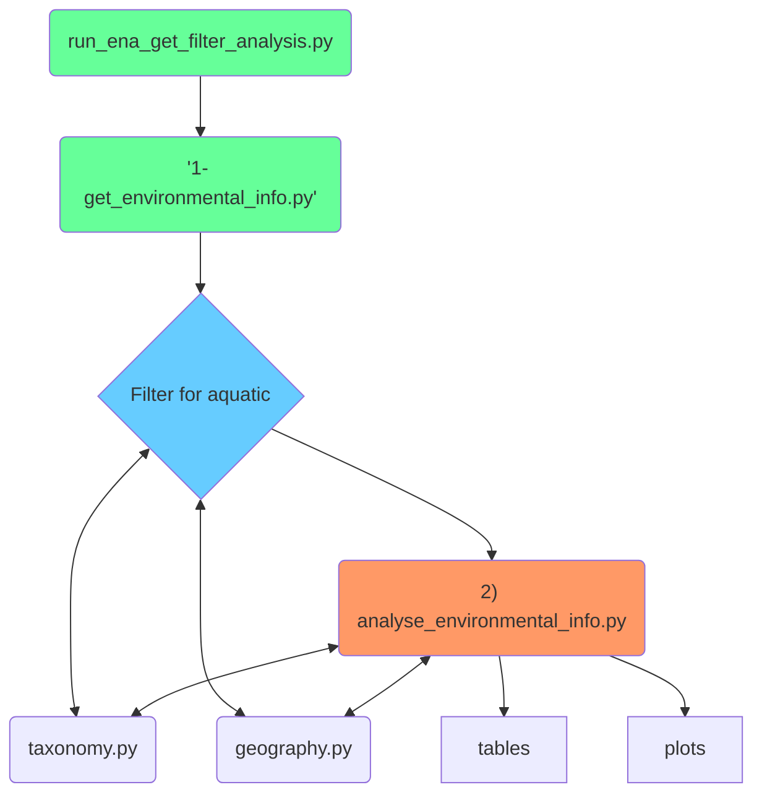

# eDNAqua-Plan wp2_t2.2

Apologies: the name of this repo. is wrong it should have been **eDNAqua-Plan** i.e. with just one A

eDNAqua-Plan code and data used for some of the deliverables of the overall eDNAAquaPlan.
N.B. This code is  rough and ready! It is generating tables and plots for the report.

This currently focuses on the needs of T2.2 in WP2. D2.2: Report containing an inventory of the ongoing and completed eDNA initiatives and repositories, identifying their geographical, ecological and taxonomic coverages.

Much data is being generated collated by the bioinformatics team of WP2, including:
Yannis Kavakiotis and Dawid Krawczyk.

 Biodiversity and marine guidance from Joana Pauperio and Stephane Pesant.

## Review of aquatic environmental DNA Initiatives and Projects
We will contrast current eDNA data from projects/repositories with information on spatial distribution (geographical/ecological gradients), ecological diversity and ecosystem types.

## Focus on ENA/INSDC environmental DNA

## Other Information
- [Overview of the aquatic filtering](docs/details/aquatic_filtering.md)
- [Where eDNA archives fit, overview](docs/details/where_eDNA_archives_fit.md)
- [eDNA and genetic reference libraries](docs/details/interoperability.md)
- Plot of experiment related info

